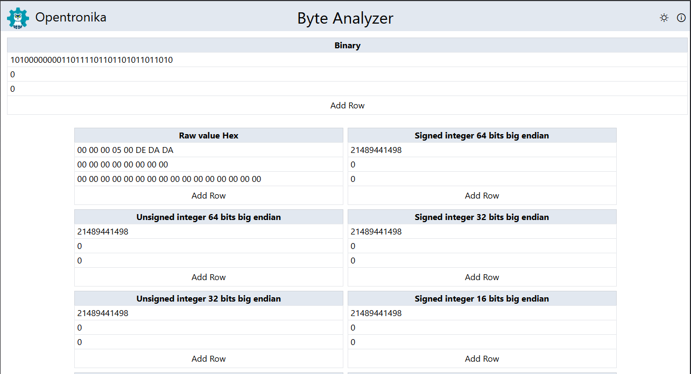

# Byte Analyzer

Byte Analyzer is a tool to visualize and edit byte values, showing their representation in hexadecimal, binary, and various data types (e.g., uint8, uint16, int8, int16, int32, int64, etc).  
Easily convert and inspect how a value is interpreted in different formats.

## Features

- View and edit byte values
- See values in hexadecimal and binary
- Instantly convert between signed and unsigned types (int8, uint8, int16, uint16, int32, uint32, int64, uint64)
- Responsive UI built with [Vue.js](https://vuejs.org/), [Astro](https://astro.build/), and [Tailwind CSS](https://tailwindcss.com/)

## Author

Made by [Lut Garu](https://www.linkedin.com/in/adrian-neftali-sanchez-b027b9b7/) 🙂